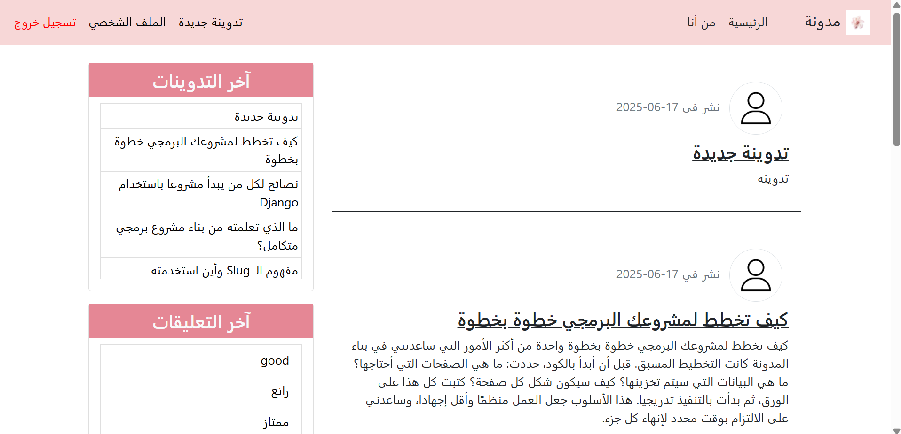
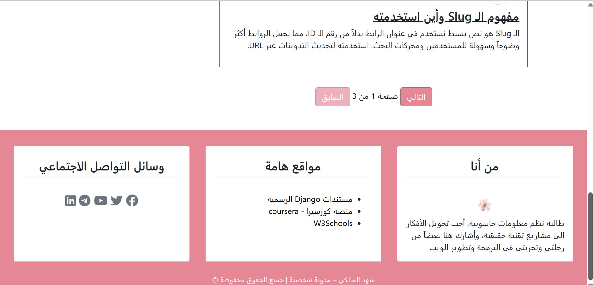

# Blogger - Django Blog Project

A simple blog platform built with Django.

## 🖼️ Preview

  
  

## 🚀 Features
- Create, update, delete blog posts
- View post details
- Comment on posts and edit their own comments
- Filter posts by author or category
- Admin dashboard for full management

## 🛠 Tech
- Django 5.x
- Python 3.12
- Bootstrap 5
- Crispy Forms (Bootstrap 5)

## ▶️ How to Run
1. Clone the repo & navigate to project folder  
2. Create virtual environment & activate it  
3. Install dependencies:  
   `pip install -r requirements.txt`  
4. Run the development server:  
   `python manage.py runserver`